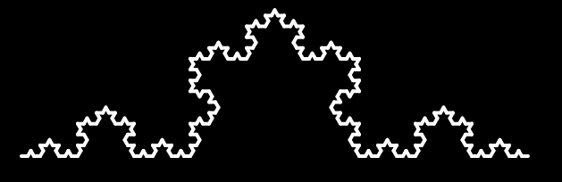

**********************
Fractals and L-Systems
**********************

* **Worth**: 5%
* **DUE**: TBA; submitted on MOODLE.

Learning objectives:

* Write some code
* Solving a question
* Thinking abstractly
* Work with existing code
* Understand existing code
* Variables
* Using functions
* Boolean operators
* Conditionals
* Comments
* Using your code to answer questions

.. warning::

   The assignment is individual.
   You should **not** expect to be able to sit down and just start coding a solution. 
   Computer science does not work this way. Expect this assignment to take hours.
   Expect to get things wrong, then, expect to get things wrong more. 
    

In this assignment you will draw fractals using the Lindenmayer System (or L-System).

Lindenmayer System
==================

The Lindenmayer System is a formal language created by the biologist Aristid Lindenmayer to represent how plant cells grow.

The `L-System <https://en.wikipedia.org/wiki/L-system>`_ is a recursive system that is very powerfull to create fractals and in particular realistic plant fractals.

.. figure:: ./img/Dragon_trees.jpg
	:align: center

L-Systems works by using a formal language to form a recursive set of instructions.

In programming recursive functions means a function **calling** itself.

.. admonition:: Example
	:class: example

	One example could be function :code:`countdown(n)` that count from :code:`n` to 0:

	.. code-block::

		def countdown(n):
			print(n)
			if n > 0:
				countdown(n-1)
				

The idea is to combine recursive function in Python and the recursive formal language of the L-System.

Consider the L-System rule :math:`F \rightarrow F+F-` for the python Turtle:

*  :math:`F`: means moving forward **or** call the function again.
*  :math:`+`: means turning right
*  :math:`-`: turning left

Similarly to our :code:`countdown` function the rule needs to stop, when it is the last **call** :math:`F` means :code:`forward`.

If it is not the lasT **call** it means calling the rule again.

.. admonition:: Example
	:class: example

	We want to create the python function of the L-System rule :math:`F \rightarrow F+F-`.

	This rule is called Levy C Curve, we obtain the following code:

	.. code-block::

		def levy_c(iterations, length, angle):
			"""
			:param iteration: The numner of iteration or the depth of the recursion.
			:param length: the length of one forward.
			:param angle: the angle to turn right or left.
			"""
			
			if iterations == 0:
				# If iteration is equal to 0 then we apply F as one forward.
				forward(length)
			else:
				# Otherwise we apply the rule F+F-

				# First we remove one iteration to ensure that it stops!
				iterations = iterations - 1

				# As it is not iteration == 0, this "F" calls the function again
				levy_c(iterations, length, angle)
				# This is our "+" meaning turning right
				right(angle)
				# This is the other "F"
				levy_c(iterations, length, angle)
				# This is "-" meaning turning left
				left(angle)

	Concretely if 

Complete Latitude/Longitude Conversion Function
===============================================

Humans like to express `latitudes <http://en.wikipedia.org/wiki/Latitude>`_ and  `longitudes <http://en.wikipedia.org/wiki/Longitude>`_ in degrees, minutes, and seconds. You *could* work with those units in Python, but your computations (and, hence, code) will
be much *cleaner* if you convert to the single unit "degrees", using decimals of a degree to represent arcminutes and arcseconds (don't worry, I swear you that this isn't that complicated).

Your first task will be to fill out the code for the function ``convert_to_decimal()``. The parameters are a latitude (or longitude) in degrees, arcminutes, and arcseonds. The function should return the same latitude (or longitude) as a single value in decimal degrees
(a single value of type ``float``). If you're not sure how to compute the conversion, `do some reading <http://en.wikipedia.org/wiki/Arcminute>`_.

Have a peek at the data-loading function
========================================

The function that loads the data is a freebie. It contains some stuff we haven't discussed in class yet, but it's pretty simple to figure out what's going on if you look at it and hack around. So... look at it. Get used to looking at code that isn't yours, using  unfamiliar ideas/idioms/patterns, and trying to figure out what it does. This isn't always simple (sometimes it's **very hard**), but you'll spend a lot of time doing it (whether you want to or not!). 

This data in the .csv file is fortunately already in decimal format so you will not need to  convert it with ``convert_to_decimal()``, however, you still need to do part 1 and make sure  it works properly even though you might not actually use ``convert_to_decimal()`` for the below parts!!!!!!

.. warning::
   
	This .csv file **MUST** be in the same directory as your python script!!!! This means in your Colab project or in the same directory on your computer if you are doing it not on Colab. If it is not, this function will **NOT** work!!! You'll see something like ``No such file or directory: 'starbucks.csv'`` if you don't have the file in the right place. 

Complete the function to compute lat-long rectangle area
========================================================

We want to compute the *density* of Starbucks, not just the raw number of them. A reasonable measure for this is 'Starbucks per square kilometer'. To compute this, we first need to know how to find the area of a lat-long rectangle. The function ``subtended_area()`` takes as parameters the 'bottom left' and 'top right' corners of a lat-long rectangle (or, the left and bottom lines, and then the right and top lines). It should return the area of that lat-long rectangle in square kilometers. 

To save you some solid angle computations: given two lat/long pairs, the formula to compute the subtended area is:

.. image:: ../img/asn1IMG.png

where *R* is the radius of the sphere (Earth in this case: 6378.1 km). 

.. warning::
	Do Python's trig functions (e.g. ``math.sin`` or ``numpy.sin``) expect parameters in *degrees* or *radians*? Be careful!

   
Complete the function that counts the number of Starbucks in a region
=====================================================================

Counting up the number of Starbucks in a given area. The function ``num_starbucks()`` is already set up to *loop* over every Starbucks location in a *list*. All you have to do is remember to pass in the list. Have a look a the loop. Even if we haven't formally discussed this structure in class yet, it should be pretty clear what it's doing.

.. note::
    Fortunately, the data coming in is **already in decimal format**, so there is no need to actually  convert these values with the ``convert_to_decimal`` function.

Your work is in the body of the loop. Each time through the loop we'll be considering a new Starbucks location. The existing code will put the current location's latitude in ``loc_lat`` and longitude in ``loc_lon``. Your job is to figure out if this location falls in the area between the lat/long pairs defining your region. If this location is within the box defined by the lats and longs then it is in our defined region and we need to count it. 

You need to keep track of how many Starbucks there are in the region and then return that
value.

.. image:: ../img/a1-LatLongSquareCounr.png

If the existing code is scaring you, think about it this way:

* There exists a robot that needs to be programmed
* The robot will receive a new Starbucks location, one after the other, until there are no more locations. **(already coded for us)**
* Robot will take the location, and ``IF`` the location is within the rectangle we care about, we count it, otherwise, ignore it. **(we need to code this bit)**

Finally
=======

Finally, fill in a convenience function ``starbucks_per_kmsq()`` which, given subtending lat/long pairs, returns the density of Starbucks. 

TODO:

* Use ``load_asn1_data()`` to load the locations and store them in a variable.
* Compute the number of Starbucks in the region
* Compute the size (area) of the region
* Divide number of Starbucks by area to get density
* return density

Now try it!
===========

Try your code. Try small regions and big regions. What area has the highest Starbucks density you can find? The lowest? Make sure to print them out. 

What to submit to Moodle
========================

Submit your work on Moodle. 

* Your version of ``asn1.py``. Do **not** submit the .ipynb file. To get the asn1.py file from Colab, see the image below. 

	* Make sure your **NAME** and **STUDENT NUMBER** appear in a comment at the top of the program.
	* List anyone you worked with in the comments, too

* A text file describing the areas you found with the highest, and lowest, Starbucks densities and a short description of how you found them.  
	* Don't worry about finding the HIGHEST or LOWEST density, just try a few and pick your highest and lowest. 

**VERIFY THAT YOUR SUBMISSION TO MOODLE WORKED!**
**IF YOU SUBMIT INCORRECTLY, YOU WILL GET A 0**

.. image:: ../img/downloadPy.png

Some hints
==========

* Work on one function at a time. 
* Get each function *working perfectly* before you go on to the next one. 
* *Test* each function as you write it. 
	* This is a really nice thing about programming: you can call your functions and see what result gets returned. Does it seem correct?
* If you need help, *ask*! Drop by my office hours. 

Some marking details
====================

.. warning::
	Just because your program produces the correct output, that does not necessarily mean that you will get perfect, or even that your program is correct.

Below is a list of both *quantitative* and *qualitative* things we will look for:
 
* Correctness?
* Did you follow instructions?
* Comments?
* Variable Names?
* Style?
* Did you do just weird things that make no sense?

General FAQ:
============

* Does my text file have enough details?
	* Probably. The shorter the better. I really just want to see that you played around a little.
* I don't know how to do *X*.
	* OK, go to `google.ca <https://www.google.ca>`_ and type in *X*.
* It’s not working, therefore Python is broken!
	* Probably not; you’re very likely doing something wrong
* My thing keeps telling me ``No such file or directory: 'starbucks.csv'``
	* Then the starbucks file probably isn't where python is looking.
* Is my area a high/low enough density?
	* I really don't care how high/low it is. Just try a few things and see what you get.    
* Do I have enough comments?
	* I don't know, maybe? If you're looking at code and have to ask if you should comment it... just comment it. That said, don't write me a book.
* Can I work with my friend?
	* Yes, with at most one friend.
* I know I cheated, but I’m really sorry [that I got caught]. Can we just ignore it this time?
	* No
* If I submit it at 11:56pm, you’ll still mark it, right? I mean, commmmon!
	* No. 11:55pm and earlier is on time. Anything after 11:55pm is late. Anything late is not marked. It’s rather simple really.
* Moodle was totally broken, it’s not my fault it’s late.
	* Nice try.
* I accidentally submitted the wrong code. Here is the right code, but it’s late. But you can see that I submitted the wrong code on time! You’ll still accept it, right?
	* Do you think I was born yesterday? No.

