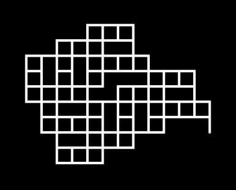

**********************
Fractals and L-Systems
**********************

* **Worth**: 5%
* **DUE**: TBA; submitted on MOODLE.

Learning objectives:

* Write some code
* Solving a question
* Thinking abstractly
* Work with existing code
* Understand existing code
* Variables
* Using functions
* Boolean operators
* Conditionals
* Comments
* Using your code to answer questions

.. warning::

   The assignment is individual.
   You should **not** expect to be able to sit down and just start coding a solution. 
   Computer science does not work this way. Expect this assignment to take hours.
   Expect to get things wrong, then, expect to get things wrong more. 
    

In this assignment you will draw fractals using the Lindenmayer System (or L-System).

.. figure:: ./img/koch_curve.png
	:align: center

|

Download the :download:`asn1.ipynb <./asn1.ipynb>` notebook and upload it to Colab to get started. See below image. **WARNING:** You should be sure to save a copy of this to your Google drive and then work with that one. You don't have to, but you will have to re-upload the project every time you want to work on it. 

|

Lindenmayer System
==================

The Lindenmayer System is a formal language created by the biologist Aristid Lindenmayer to represent how plant cells grow.

The `L-System <https://en.wikipedia.org/wiki/L-system>`_ is a recursive system that is very powerful to create fractals and in particular realistic plant fractals.

.. figure:: ./img/Dragon_trees.jpg
	:align: center

|

L-Systems works by using a formal language to form a recursive set of instructions.

In programming recursive functions means a function **calling** itself.

.. admonition:: Example
	:class: example

	One example could be a function :code:`countdown(n)` that count from :code:`n` to 0:

	.. code-block::

		def countdown(n):
		  print(n)
		  if n > 0:
		    countdown(n-1)
				

The idea is to combine recursive function in Python and the recursive formal language of the L-System.

Consider the L-System rule :math:`F \rightarrow F+F-` for the python Turtle:

*  :math:`F`: means moving forward **or** call the function again.
*  :math:`+`: means turning right
*  :math:`-`: means turning left

Similarly to our :code:`countdown` function the rule needs to stop. When it is the last **iteration** :math:`F` means :code:`forward`.

If it's not the last **iteration** it means using the rule again.

.. admonition:: Example
	:class: example

	If we execute the rule only once, we call it iteration :math:`0`, then the rule is :math:`F`.

	Now if we increase the iterations, we take the previous iteration and we replace each :math:`F` by :math:`F+F-`:

	*  Iteration :math:`1`, the rule becomes: :math:`F+F-`.
	*  Iteration :math:`2`, the rules becomes: :math:`F+F-+F+F--`
	*  Iteration :math:`3`, the rules becomes: :math:`F+F-+F+F--+F+F-+F+F---`

	And we can continue forever.

Now it needs to be transformed in Python.

.. admonition:: Example
	:class: example

	We want to create the python function of the L-System rule :math:`F \rightarrow F+F-`.

	This rule is called Levy C Curve, we obtain the following code:

	.. code-block::

		def levy_c(iterations, length, angle):
			"""
			:param iteration: The number of iterations or the depth of the recursion.
			:param length: the length of one forward.
			:param angle: the angle to turn right or left.
			"""
			
			if iterations == 0:
				# If iteration is equal to 0 then we apply F as one forward.
				forward(length)
			else:
				# Otherwise we apply the rule F+F-

				# First we remove one iteration to ensure that it stops!
				iterations = iterations - 1

				# As it is not iteration == 0, this "F" calls the function again 
				# replacing "F" by "F+F-".
				levy_c(iterations, length, angle)
				# This is our "+" meaning turning right
				right(angle)
				# This is the other "F" that we replace by "F+F-"
				levy_c(iterations, length, angle)
				# This is "-" meaning turning left
				left(angle)

	Concretely if we use this for iteration 0, we obtain only forward (:math:`F`):

	.. code-block::

		levy_c(0, 50, 90)

	.. figure:: ./img/example_00.png
		:align: center

	|

	If we apply for iteration 1, we obtain :math:`F+F-`.

	.. code-block::

		levy_c(1, 50, 90)

	We see that it draws forward then turn right, and finally draw forward again. Turning is not drawing anything, so we don't see it.

	.. figure:: ./img/example_01.png
		:align: center

	|

	If we apply for iteration 2, we obtain :math:`F+F-+F+F--`.

	.. code-block::

		levy_c(2, 50, 90)

	We see that it draws forward,turn right, draw forward again, turn left then right, so it doesn't change the direction.
	
	Then draw forward again, turn right and draw a final line.

	.. figure:: ./img/example_02.png
		:align: center

	|

	If we apply for iteration 3, we obtain :math:`F+F-+F+F--+F+F-+F+F---`.

	.. code-block::

		levy_c(3, 50, 90)

	Convince yourself that it actually draw the following figure. 

	.. figure:: ./img/example_03.png
		:align: center

	|

	.. note::

		Use a piece of paper and do it manually if you're not sure.

Now you know all you need for the actual assignment!

Complete the following functions
================================

You need to implement the following function to draw the L-System rule provided.

If the function is implemented correctly, it must draw the same thing.

Blobs
-----

This fractal follows the rule :math:`F \rightarrow F+F-F+`.

Complete the following function:

.. code-block::

	def blobs(iterations, length, angle):
		"""
		This function draw the blobs fractal.
		
		:param iterations: Number of iterations left
		:param length: Length of the forward line
		:param angle: Turn angle
		"""

		# Write your code there.
		# Don't forget the case for iteration 0!

If used as:

.. code-block::

	blobs(5, 25, 90)

You should obtain:

|

Tiling
------

This fractal follows the rule :math:`F \rightarrow FFF-F`.

Complete the following function:

.. code-block::

	def tiling(iterations, length, angle):
		"""
		This function draw the tiling fractal.
		
		:param iterations: Number of iterations left
		:param length: Length of the forward line
		:param angle: Turn angle

		"""

		# Write your code there.
		# Don't forget the case for iteration 0!

If used as:

.. code-block::

	tiling(5, 10, 90)

You should obtain:

|

Koch curve
----------

The Koch curve is one of the best known fractal and follow the simple rule :math:`F \rightarrow F+F-F+`.

Complete the following function:

.. code-block::

	def koch_curve(iterations, length, angle):
		"""
		This function draw the Koch curve.

		:param iterations: Number of iterations left
		:param length: Length of the forward line
		:param angle: Turn angle

		"""

		# Write your code there.
		# Don't forget the case for iteration 0!

If used as:

.. code-block::

	koch_curve(4,7,60)

You should obtain:

.. figure:: ./img/koch_curve.png
	:align: center

|

Two rules
=========

It is possible to use two different rules at the same time.

The rules call each other to create more complicated fractal.

The following one is based on Sierpinski triangles and the rules are:

*  :math:`X \rightarrow FYY`
*  :math:`Y \rightarrow X-X`

The starting rule is :math:`X` and as you can see only :math:`X` as a move forward :math:`F`.
So :math:`Y` doesn't use forward, it only calls :math:`X`, turn left, then call :math:`X` again.

You need to implement the following functions:

.. code-block::

	def sierpinski_X(iterations, length, angle):
		"""
		This function draw the sierpinski fractal.
		
		:param iterations: Number of iterations left
		:param length: Length of the forward line
		:param angle: Turn angle
		"""
		
		# Write your code there.
		# Don't forget the case for iteration 0!

	def sierpinski_Y(iterations, length, angle):
		"""
		This function is part of the sierpinski fractal.
		If iterations is equal to 0 nothing happens.
		
		:param iterations: Number of iterations left
		:param length: Length of the forward line
		:param angle: Turn angle
		"""

		# Write your code there.
		# For iteration 0 you do nothing. You only do something if iterations > 0.

If used as:

.. code-block::

	sierpinski_X(10, 10, 90)

You should obtain:

|

Now try it!
===========

Try your code. Do not hesitate different parameters if you want.

Be careful to not increase iterations too much otherwise it will run for a very very long time.

.. important::

	Once you're done put back the default parameter for each functions.

What to submit to Moodle
========================

Submit your work on Moodle. 

* Your version of ``asn1.py``. Do **not** submit the .ipynb file. To get the asn1.py file from Colab, see the image below. 

	* Make sure your **NAME** and **STUDENT NUMBER** appear in a comment at the top of the program.

**VERIFY THAT YOUR SUBMISSION TO MOODLE WORKED!**
**IF YOU SUBMIT INCORRECTLY, YOU WILL GET A 0**

Some hints
==========

* Work on one function at a time. 
* Get each function *working perfectly* before you go on to the next one. 
* *Test* each function as you write it. 
	* This is a really nice thing about programming: you can call your functions and see what result gets returned. Does it seem correct?
* If you need help, *ask*! Drop by my office hours. 

Some marking details
====================

.. warning::
	Just because your program produces the correct output, that does not necessarily mean that you will get perfect, or even that your program is correct.

Below is a list of both *quantitative* and *qualitative* things we will look for:
 
* Correctness?
* Did you follow instructions?
* Comments?
* Variable Names?
* Style?
* Did you do just weird things that make no sense?

General FAQ:
============

* I don't know how to do *X*.
	* OK, go to `google.ca <https://www.google.ca>`_ and type in *X*.
* It's not working, therefore Python is broken!
	* Probably not; you're very likely doing something wrong
* Do I have enough comments?
	* I don't know, maybe? If you're looking at code and have to ask if you should comment it... just comment it. That said, don't write me a book.
* Can I work with my friend?
	* No.
* I know I cheated, but I'm really sorry. Can we just ignore it this time?
	* No
* If I submit it at 11:56pm, you'll still mark it?
	* No. 11:55pm and earlier is on time. Anything after 11:55pm is late. Anything late is not marked. It's rather simple really.
* I accidentally submitted the wrong code. Here is the right code, but it's late.
	* No.

