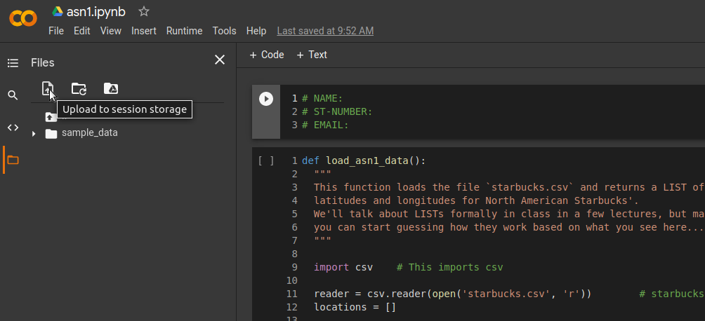
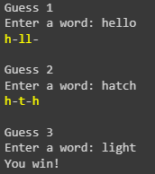

******
Wordle
******

* **Worth**: 10%
* **DUE**: March 2nd, 2023; submitted on MOODLE.

Learning objectives:

* Write some code
* Solving a *real* problem/question
* Thinking abstractly
* Work with existing code
* Understand existing code
* Variables
* Using functions
* Boolean operators
* Conditionals
* Comments
* Using your code to answer questions
* Using loops

.. warning::

   For this assignment, you may work with **one** other student. Only one of you need to submit your work, but put **both** your names and student numbers!
   By all means communicate with each other at a high level (that's good), but your code needs to be your own here. 

.. warning::
   
	You should **not** expect to be able to sit down and just start coding a solution. Computer science does not work this way. Expect this assignment to take hours. Expect to get things wrong, then, expect to get things wrong more. 
    

In this assignment, you will use a list of 5 character words to create a game of wordle similar to `Wordle <https://www.nytimes.com/games/wordle/index.html>`_.

To make life easier for the second assignment, you don't have to start from scratch. I've already started a file for you to use as a template. This is also somewhat realistic for programmers; you don't always start completely from scratch... Sometimes you're trying to modify someone else's code that you downloaded or inherited. Also, learning how to work with existing code is a huge way to learn. 

Download the `asn2.ipynb` notebook from Moodle and upload it to Colab to get started. See below image. **WARNING:** You should be sure to save a copy of this to your Google drive and then work with that one. You don't have to, but you will have to re-upload the project every time you want to work on it. 

.. image:: ../../img/uploadColab.png

The steps you need to do are laid out, in detail (and suggested order) below.

.. warning::
	Do not alter the function details in the .ipynb/.py files:
   
		* Do not change the name of the functions
		* Do not remove the function description
		* Do not remove or add to the parameters
	  

You will also need the data file :download:`wordle.csv <../../assignments_files/wordle.csv>`. Download this to your computer and upload it to your Colab files (see below image).
Unfortunately, every time you open your colab project, you will need to re-upload. Not a big deal, but something you will need to remember. 

If you would like to *not* use Colab and work from your own computer, then just be sure to save this file in the **same directory** that you are saving your assignment in. 

Complete the function to choose a word
======================================

You will need to choose a word for that the player will need to guess.

Your first task will be to fill out the code for the function ``choose_a_word(list_of_words)``. The parameters is the list of possible words. The function should return one random word from this list. If you don't know how to do it, `do some reading <https://numpy.org/doc/stable/reference/random/generated/numpy.random.choice.html>`_.

Have a peek at the data-loading function
========================================

The function that loads the data is a freebie. It contains some stuff we haven't discussed in class yet, but it's pretty simple to figure out what's going on if you look at it and hack around. So... look at it. Get used to looking at code that isn't yours, using  unfamiliar ideas/idioms/patterns, and trying to figure out what it does. This isn't always simple (sometimes it's **very hard**), but you'll spend a lot of time doing it (whether you want to or not!). 

It will return a list of 5 letter words.

.. warning::
   
	This .csv file **MUST** be in the same directory as your python script!!!! This means in your Colab project or in the same directory on your computer if you are doing it not on Colab. If it is not, this function will **NOT** work!!! You'll see something like ``No such file or directory: 'wordle.csv'`` if you don't have the file in the right place. 

Have a peek at the color function
=================================

The function that color the letters printed is also a freebie. It contains some stuff that we will NOT discuss in class.

It returns a char (or string) in the color asked:

*  ``ORANGE``: for letter in the word but misplaced.
*  ``GREEN``: for letter in the word and at the correct position.
*  Everything else in black (or default color).

Complete the function that give a hint to the player
====================================================

This function take two words:

*  ``player_guess``: the word entered by the player.
*  ``word_to_guess``: The word that the player has to guess.

You need to verify for each letter in ``player_guess``:

*  If the letter is in ``word_to_guess`` AND correctly placed. In this case you color the letter in green and put in ``hints``.
*  If the letter is in ``word_to_guess`` AND misplaced. In this case you color the letter in orange and put in ``hints``.
*  Otherwise you color the character ``-`` in ``BLACK`` and put in hints.

   
Complete the function that launch the main loop
===============================================

In the game wordle, the player is allowed 5 guesses. This function require a loop that will be executed 5 times for each guess that the player can have. In the loop, you will print the guess number, then ask the player a 5 letter word.

With the input, you verify if the guess is equal to ``word_to_guess``. If it is the case, the function return ``True``, otherwise you need to give an hint to the player by calling ``give_hint(player_guess, word_to_guess)``.

At then end of the five loops, if the player didn't guess the word, return false.

.. note::
    Consider that the player will always enter a correct input. Do not do any verification.

Finally
=======

Finally, fill in a convenience function ``wordle()`` which put everything together. 

TODO:

* Use ``load_asn2_data()`` to load the words in a variable.
* Choose a word to guess and put it in a variable.
* Launch the main loop of the game and put the result in boolean variable.
* Check if the boolean variable is true or false and print a message to say if the player won or lost.

Below an example of how it should run:

Now try it!
===========

Try your code and have fun!

What to submit to Moodle
========================

Submit your work on Moodle. 

* Your version of ``asn2.py``. Do **not** submit the .ipynb file. To get the asn2.py file from Colab, see the image below. 

	* Make sure your **NAME** and **STUDENT NUMBER** appear in a comment at the top of the program.
	* List anyone you worked with in the comments, too

**VERIFY THAT YOUR SUBMISSION TO MOODLE WORKED!**
**IF YOU SUBMIT INCORRECTLY, YOU WILL GET A 0**

.. image:: ../img/downloadPy.png

Some hints
==========

* Work on one function at a time. 
* Get each function *working perfectly* before you go on to the next one. 
* *Test* each function as you write it. 
	* This is a really nice thing about programming: you can call your functions and see what result gets returned. Does it seem correct?
* If you need help, *ask*! Drop by my office hours. 

Some marking details
====================

.. warning::
	Just because your program produces the correct output, that does not necessarily mean that you will get perfect, or even that your program is correct.

Below is a list of both *quantitative* and *qualitative* things we will look for:
 
* Correctness?
* Did you follow instructions?
* Comments?
* Variable Names?
* Style?
* Did you do just weird things that make no sense?

General FAQ:
============

* I don't know how to do *X*.
	* OK, go to `google.ca <https://www.google.ca>`_ and type in *X*.
	* If you are still stuck, come to my office hours.
* It’s not working, therefore Python is broken!
	* Probably not; you’re very likely doing something wrong
* My thing keeps telling me ``No such file or directory: 'wordle.csv'``
	* Then the wordle file probably isn't where python is looking.  
* Can I work with my friend?
	* Yes, with at most one friend.
* If I submit it at 11:56pm. 
	* 11:55pm and earlier is on time. Anything after 11:55pm is late. Anything late is not marked. It’s rather simple really.

