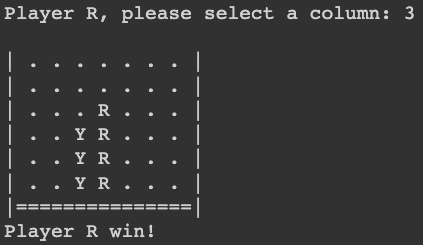
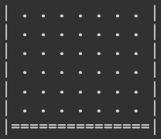

**************************************************************
Assignment #3: I'm only taking programming to make video games
**************************************************************

* **Worth**: 15%
* **DUE**:TBA; submitted on MOODLE.
* Starting point:
   * Interpreting requirements correctly
   * Validating input
   * Debugging
   * 2D lists
   * Generalizing rules 

.. warning::

   For this assignment, you may work with **one** other students. Only one of you need to submit your work, but put **both** your names and student numbers!
   By all means communicate with each other at a high level (that's good), but your code needs to be your own here. 

.. warning::

    Remember, List vs. Pointer to a List! Review the discussion on :ref:`label-topic8-aliasing`.
    

It's time. With the skills we've learned so far, we're going to make one of the most badass video games of all time. Are you ready? We're going to make a Connect 4 game from scratch!

For those of you that don't know what this amazing game is, `check out Wikipedia <https://en.wikipedia.org/wiki/Connect_Four>`_. 

This assignment will be a little bit different from the previous two.

**DO NOT PANIC THOUGH**. 

I will still be guiding you through this assignment. Remember, try not to think about solving the problem all at once. We want to solve the little problems. In fact, most of the time we want to break the little problems into littler problems, and then break them down even more... Then, once we write some code, even if it's 1 or 2 lines, **we always make sure those lines do what we expect!** Being the good programmers like you are, I am certain that you were going to do this already. 

.. warning::

    I'm not playing. Test everything you do in every way you can think to try to break it. This assignment is very constructive. If something early doesn't work then you'll be in trouble. 

Some of the functions I'll have you write at first may seem complicated, but don't worry, it will all come together in the end. 

Now, when I say, **Connect4**, I mean **Connect4**. 

Download the :download:`asn3.ipynb <../assignments_files/asn3.ipynb>` notebook and upload it to Colab to get started. See below image. **WARNING:** You should be sure to save a copy of this to your Google drive and then work with that one. You don't have to, but you will have to re-upload the project every time you want to work on it. 

.. image:: ../img/uploadColab.png

The steps you need to do are laid out, in detail (and suggested order) below.

.. warning::
	Do not alter the function details in the .ipynb/.py files:
   
		* Do not change the name of the functions
		* Do not remove the function description
		* Do not remove or add to the parameters
	  

Coding, Part I
==============

1. Write a function ``create_grid()`` that will simply create a grid (2D list) for the **Connect 4** of the correct size 6X7. Initially, you will insert "." in the lists. Eventually we will replace these "."" characters with either an 'R' or an 'Y'. **Once you are done, test the function! Seriously, test it thoroughly. If these early functions do not work properly, the latter functions are gonna have a bad time.** Warning, be careful with pointers here!

2. Write ``is_full(grid)`` that will verify if the grid is full or not. To know if there is some space left, you just need to verify if there is a ``.`` in the grid.

3.  Write ``get_line_in_col(grid, column)`` that will return the next free cell in the column starting from the bottom. To know if the cell is free, verify if ``.`` is in the cell.

4. Write ``drop_token(grid, column, token)``. This function will take the grid, the column and the token. It will call get_line_in_col to know where to add the token in the column. It will modify the grid for the specific line and column. Finally, it will return the line where the token was placed. **Again, once you are done, test the function!**

.. image:: ../img/a3_player.png

5. Write the function ``check_line(grid, line, token)``. This function check if the player aligned 4 token (or more) on the same line. To simplify the implementation we start at the beginning of the line. Each time a token of the player is found had 1 to a counter. If the counter each 4, return True. If a token of another player is found, reset the counter to 0. At the end of the line, if the counter never reached 4, return False. **Again, once you are done, test the function!**

6. Write the function ``check_column(grid, column, token)``. This function check if the player aligned 4 token (or more) on the same column. To simplify the implementation we start at the beginning of the column. Each time a token of the player is found had 1 to a counter. If the counter each 4, return True. If a token of another player is found, reset the counter to 0. At the end of the column, if the counter never reached 4, return False. **Again, once you are done, test the function!**

7. Write the function ``won(grid, line, column, token)``. This function verifies if the player won. It calls ``check_line``, ``check_column`` and ``check_diag``. If one is true return True. Otherwise return False.

	  
	  
Coding, Part II
===============

Now it's time to put all of the above together to actually make the game be a game. 

1.  Write a function ``connect4()`` that will set up the game, and perform the execution of Connect 4. 

Below is some pseudocode for this function. 

   .. code-block:: python
   
      create grid
      initialize the token to R
	  
      draw the grid

      while the grid is not full
         ask the column to the user (input)
         drop the token in the column and get the line
         
         draw the grid

         see if the player won
         else figure it out the next player that needs to play (token)

 
	  
Some things to note:
   * R always goes first
   * The game can end in a draw

What to submit
==============

* Your version of ``asn3.py``. Also, please **DO NOT** change the name of this file. Leave it alone. 

  * Make sure your **NAME** and **STUDENT NUMBER** appear in a comment at the top of the program.
  * Make sure it's *commented* and has *function headers*!!
  * Use proper variable names
  
General FAQ:
============

* I don't know how to do *X*.
	* OK, go to `google.ca <https://www.google.ca>`_ and type in *X*.
	* If you are still stuck, come to my office hours.
* It’s not working, therefore Python is broken!
	* Probably not; you’re very likely doing something wrong
* Do I have enough comments?
	* I don't know, maybe? If you're looking at code and have to ask if you should comment it... just comment it. That said, don't write me a book.
* Can I work with my friend?
	* Yes, with at most one friend.
* I know I cheated, but I’m really sorry [that I got caught]. Can we just ignore it this time?
	* No
* If I submit it at 11:56pm, you’ll still mark it, right? I mean, commmmon!
	* No. 11:55pm and earlier is on time. Anything after 11:55pm is late. Anything late is not marked. It’s rather simple really.
* Moodle was totally broken, it’s not my fault it’s late.
	* Nice try.
