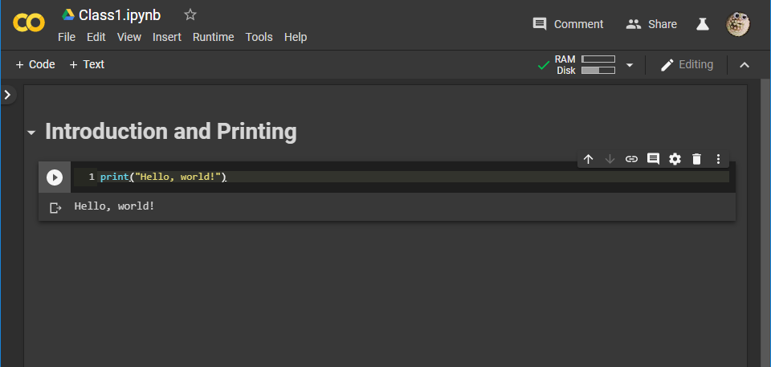

************************
Topic #1 -- Intro, print
************************

What will I learn?
==================

* The short version:
    * How to write computer programs with *python*
    * How to write programs to solve problems
    * A little bit of how computers work
    * A little bit about what on earth computer science actually is 
    * How to be a 21st century individual so you won't be left behind

* The long version:
    * :doc:`Read the outline </outline>`

 
What prerequisites do I need?
=============================

* Curiosity
* A desire to learn a powerful new skill
* A desire to distinguish yourself from peers in your discipline

.. admonition:: Activity

   Where have you encountered computer programs before?

   Can anyone name an area of Science where they think having computer 
   programming skill would be a bad thing? How about Social Science? Humanities? 
   Art? Work with your neighbours.

Why are the course notes a website?
===================================

* You're going to learn to program with Python
* A nice thing about Python is that it has a **vast** collection of *libraries* to do useful things
* Most of those libraries are documented with something called Sphinx
* The course notes are made with Sphinx
* The idea: get used to reading material in this format. It'll be useful to you
* `Here's an example <https://docs.python.org/3/library/math.html>`_
* Moodle will be used for announcements and assignment submissions

  
How will this class work?
=========================

* This class is going to be run somewhat differently from other courses you may have experienced at university 
* We're going to be using a "partially flipped" classroom, with a "microlecture" format and lots of in class hands-on time

* There are a few reasons for this:
    * It's been `demonstrated <http://www.sciencemag.org/content/332/6031/862.full?ijkey=GMW4zTHNMM1Tc&keytype=ref&siteid=sci>`_ that students from classes using the microlecture/work format outperform students from traditional lecture classes. The students are also report being happier and more engaged
    * Listening to a lecturer droning on for hours isn't very engaging

* A standard class works like this:

    * I lecture for one hour
    * You get bored 10 minutes in and start thinking about products you might like to buy on Amazon or what you're going to watch on Netflix when you get home
    * I keep going
    * You keep daydreaming...

* Our class will work like this:

    * I give a short microlecture on a topic from the readings
    * I give the class a problem to solve, based on the microlecture
    * You work with your neighbours in class to solve the problem
    * I walk around and **interact** with the class. Answering questions, giving pointers, etc.
    * I depend on **YOU** to interact with me
        * I will need your help throughout the lectures
    * We repeat this process until the time is up for the day

* We've already done this once already, but let's try it again:

.. admonition:: Activity

   Have a chat with the people sitting around you: 

   * What are their majors?    
   * Why did you come to StFX?
   * Why are they taking this class?   
   * What do you hope to learn? 
   * How do you think you will use what you learn in the future?
   
   
What should I bring to class
============================

* Curiosity
* Readiness to do stuff, rather than just listen
* A laptop (if you want) or pen and paper 
    * The weapon of choice of some of the greatest programmers in past generations

* Just to be crystal clear: you **do not** need to bring a laptop to class
* If you have one, and you're keen to get the most out of the class, it's worth considering
   

So I should be terrified?
=========================

* No
* It's actually not that bad, *if you put in the effort*
    * But that's why we're all here, right?

* Real waring though: The class is dense and very accumulative, do not fall behind!

* The good news is, you get to make mistakes
* You get to see if what you did works or not
* Most of this class will be you beating your head against your keyboard until you get it right
* Not many classes or disciplines give you this luxury

* I really can't stress this enough
    * Most of the time when you're *working* on the course material you will be getting things wrong
    * The majority of programming is actually *debugging*
    * Get used to making mistakes
        * This is a good thing
        * This is normal
   

Can I write a program now?
==========================

* If you have looked at :doc:`get set up for CSCI 128 </gettingset>`, then yes
* Go to Google Colab and make your "Hello, world!" program 
    * `"Hello, world!" <http://en.wikipedia.org/wiki/Hello_world_program>`_ is traditionally the first program one writes in a new language.
    
	``print("Hello, world!")``

* You're now officially a computer programmer!   

   
   

For next week
=============

* Get your computer at home :doc:`set up for CS 128 </gettingset>` 

