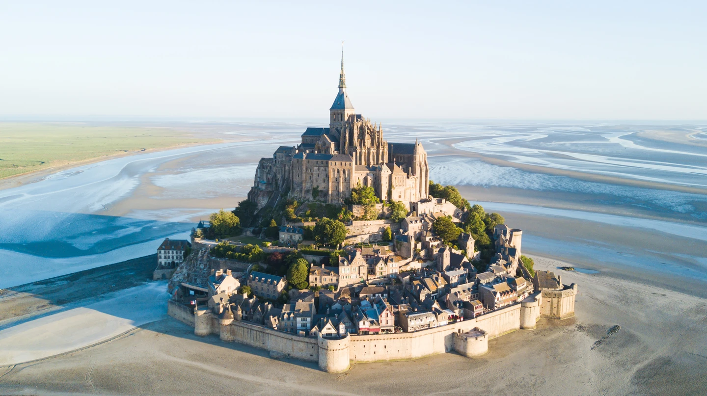
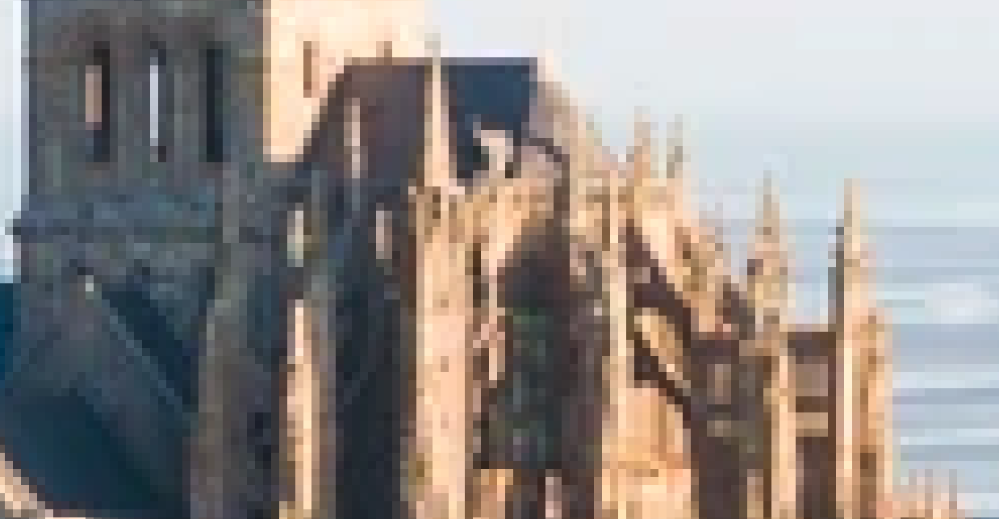
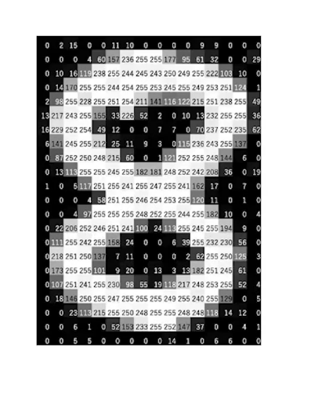

******
Images
******

The basics
==========

*  You all know what an image is.
*  But do you know how images are represented in memory?

.. admonition:: Activity
    :class: activity
    
    *  Discuss with other students and come up with a way to represent images in memory.

Theory
------

*  If you consider the image below.
*  We have lots of different colors.

|

*  If we zoom on an image, we can se that it is composed of squares that we call **pixel**.

|

*  Each pixel is composed of only one color.
*  All colors can be created with a mix of red, green and blue.
*  The images have 3 layers!
*  We call this the **RGB** standard.
*  The amount of each color is defined by a value between 0 and 255.
*  Following an example:

.. figure:: ../../img/colorpixels.png
    :align: center

|

*  For the grayscale images it is very similar, but we only have one color.

|

In Python
---------

*  We can use numpy to create our image.
*  An image is just a 2D list containing each pixel!

.. code-block:: python

    import numpy as np

    #  We create an image of 512 by 512 containing only zeros.
    w, h = 512, 512
    data = np.full((h, w), 0, dtype=np.uint8)

*  Now we can save this 2D array in a .png.

.. code-block:: python

    from PIL import Image

    img = Image.fromarray(data, 'L')
    img.save('my_graysclae_img.png')

*  The parameter `L` specify that we want a gray-scale image.
*  As you can see 0 is black while 255 is white.

.. admonition:: Activity
    :class: activity

    *  Modify the values inside this image and see what happens.

*  Now, if we want images with color we just need to define pixel with our 3 colors.
*  First, we create a black image.
*  Each pixel must have the color `[0, 0, 0]`, 0 amount of red, 0 amount of green and 0 amount of blue.

.. code-block:: python

    w, h = 512, 512
    data = np.full((h, w, 3), np.array([0, 0, 0]), dtype=np.uint8)
    img = Image.fromarray(data, 'RGB')
    img.save('my_color_img.png')

* If we want a green image:

.. code-block:: python

    w, h = 512, 512
    data = np.full((h, w, 3), np.array([0, 255, 0]), dtype=np.uint8)
    img = Image.fromarray(data, 'RGB')
    img.save('my_color_img.png')

.. admonition:: Activity
    :class: activity
    
    *  Create an image full red.
    *  Do the same thing with blue.
    *  Now, try to create images with different color ( orange, purple, etc...).

Advanced
========

*  We will try some things more advanced.
*  We could create our own image pixel by pixel, but it takes too much time.
*  So, we will open an existing one and modify it.
*  Download the image :download:`Mont Saint Michel <../../img/mont-saint-michel.png>`.
*  Now we will open it and put it in an array.

.. code-block::

    img = Image.open("mont-saint-michel.png")
    data = np.array(img)

*  It is that simple.
*  And as we have a numpy array, we can modify it the way we want.

.. admonition:: Activity
    :class: activity

   *  Check the following code and try to understand what this code is doing.

   .. code-block:: python

       def do_something_fancy(img):
           height = img.shape[0]
           width = img.shape[1]

           mirror_point = int(height/2)

           for x in range(width):
               for y in range(mirror_point):
               top_pixel = img[y, x]
               img[height-y-1,x] = top_pixel
       
       do_something_fancy(data)
       img2 = Image.fromarray(data, 'RGB')
       img2.save('my_new_img.png')

    * Try do the opposite.

Detecting contour
-----------------

*  It is possible to detect all the contours in an image.
*  The idea is to calculate the difference of luminance between two pixels.
*  The luminance is the average value between the amount of red, green and blue:

.. math::

    \frac{red + green + blue}{3}

*  If the luminance between two pixels is greater than a value, let's say 10, then it's a contour.
*  So we could just calculate the difference between all adjacent pixel 

   *  color them either in black if there is no contour
   *  Or white if there is a contour.

*  First we implement the luminance function:

.. code-block:: python
    :class: activity

    def luminance(pixel):
        r = pixel[0]
        g = pixel[1]
        b = pixel[2]
        return (r+g+b)/3

*  Now, we can implement the contour detection.

.. code-block:: python

    def edgedetect(img):
        height = img.shape[0]
        width = img.shape[1]

        for x in range(width):
            for y in range(height):
                if y < height-1 and x < width-1:
                botrt = img[y+1, x+1]
                thislum = luminance(img[y,x])
                brlum = luminance(botrt)
                if abs(brlum-thislum) > 10:
                    img[y,x] = [0,0,0]
                if abs(brlum-thislum) <= 10:
                    img[y,x] = [255,255,255]

*  Now try it on the previous picture:

.. code-block:: python

    img = Image.open("mont-saint-michel.png")
    data = np.array(img)

    edgedetect(data)
    img2 = Image.fromarray(data, 'RGB')
    img2.save('contour.png')

